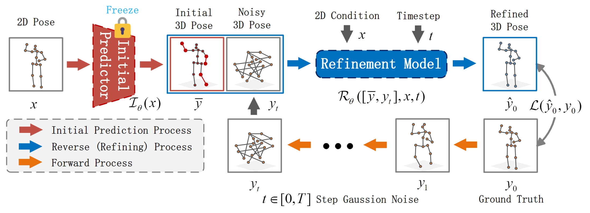
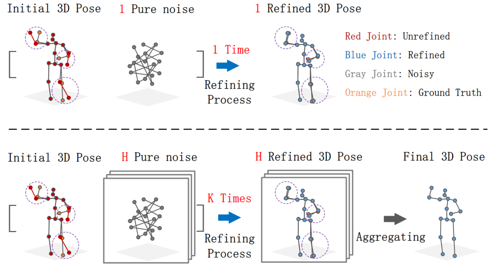

# Diffusion-based Pose Refinement and Multi-Hypothesis Generation for 3D Human Pose Estimation


> [**Diffusion-based Pose Refinement and Multi-Hypothesis Generation for 3D Human Pose Estimation**](https://arxiv.org/abs/2401.04921),             
> Hongbo Kang, Yong Wang, Mengyuan Liu, Doudou Wu, Peng Liu, Wenming Yang  
> *arXiv, 2024*

<p align="center"></p>

> This version provides refinement for single-frame models, and future versions will update refinement for multi-frame models.


## Results on Human3.6M

<p align="left"></p>

- Refinement

| Method |  MPJPE(CPN) |
|:-------|:-------:|
| HTNet | 48.9 mm |
| DRPose(w\ HTNet)* | 48.3 mm (-0.6)|
| DC-GCT | 48.4 mm | 
| DRPose(w\ DC-GCT)* | 47.9 mm (-0.5) |


- Single-hypothesis

| Method |  MPJPE(CPN) | P-MPJPE(CPN) | MPJPE(GT) |
|:-------|:-------:|:-------:|:-------:|
| HTNet | 48.9 mm |  39.0 mm |  34.0 mm |
| DC-GCT | 48.4 mm |  38.2 mm |  32.4 mm |
| GFPose* | 51.9 mm |  - |  - |
| DRPose(w\ DC-GCT)* | 47.9 mm |  38.1 mm |  30.5 mm |

- Multi-hypothesis

| Method |  Hypotheses | MPJPE | P-MPJPE |
|:-------|:-------:|:-------:|:-------:|
| GFPose         | 10 |  45.1 mm | - |
| DRPose(w\ DC-GCT)         | 10 |  41.8 mm | 33.7 mm |
| GFPose         | 200 |  35.6 mm | 30.5 mm |
| DRPose(w\ DC-GCT)         | 200 |  35.5 mm | 28.6 mm |


## Dependencies

- Python 3.7+ 
- PyTorch >= 1.10.0

```sh
pip install -r requirement.txt
```


## Dataset setup
Please download the dataset [here](https://drive.google.com/drive/folders/1gNs5PrcaZ6gar7IiNZPNh39T7y6aPY3g) and refer to [VideoPose3D](https://github.com/facebookresearch/VideoPose3D) to set up the Human3.6M dataset ('./dataset' directory). 

```bash
${POSE_ROOT}/
|-- dataset
|   |-- data_3d_h36m.npz
|   |-- data_2d_h36m_gt.npz
|   |-- data_2d_h36m_cpn_ft_h36m_dbb.npz
```

## Download pretrained model
The pretrained model is [here](https://drive.google.com/drive/folders/1AferT6j8v6qyQL5nG4OEXcd9Oe8AlKHr?usp=sharing), please download it and put it in the './checkpoint' directory.


## Test the model
To test on Human3.6M on single frame, run:

```
python main.py --test --previous_dir 'checkpoint/pretrained/cpn_dcgct_4794' --init_model 'dcgct' -k cpn_ft_h36m_dbb --samplimg_timestep 2 --num_proposals 2
```
You can balance efficiency and accuracy by adjusting `--num_proposals` (number of hypotheses) and `--sampling_timesteps` (number of iterations).

The results are saved in the './output' directory. In the results, `p_avg` and `p_best` are evaluation metrics related to pose-level, while `j_avg` and `j_best` are evaluation metrics related to joint-level. For more details, please refer to [D3DP](https://github.com/paTRICK-swk/D3DP).


## Train the model
To train on Human3.6M with single frame, run:

```
python main.py --init_model 'dcgct' -k cpn_ft_h36m_dbb --timestep 1000
```
You can set your own initial model using `--init_model` and modify the initial model loading code in `main.py`. `--timestep` is the maximum diffusion time step.

## Visualization

> coming soon


## Citation

If you find our work useful in your research, please consider citing:

    @article{kang2024diffusion,
    title={Diffusion-based Pose Refinement and Muti-hypothesis Generation for 3D Human Pose Estimaiton},
    author={Kang, Hongbo and Wang, Yong and Liu, Mengyuan and Wu, Doudou and Liu, Peng and Yuan, Xinlin and Yang, Wenming},
    journal={arXiv preprint arXiv:2401.04921},
    year={2024}
    }


## Acknowledgement

Our code is extended from the following repositories. We thank the authors for releasing the codes. 

- [DiT](https://github.com/facebookresearch/DiT)
- [D3DP](https://github.com/paTRICK-swk/D3DP)
- [GraFormer](https://github.com/Graformer/GraFormer)
- [DC-GCT](https://github.com/KHB1698/DC-GCT)
- [HTNet](https://github.com/vefalun/HTNet/tree/main)
